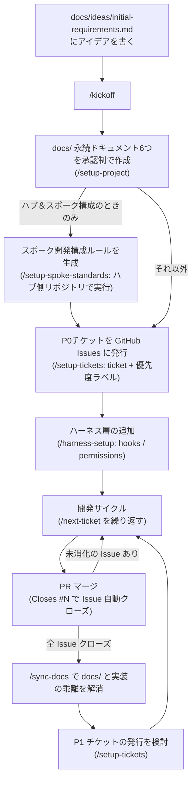
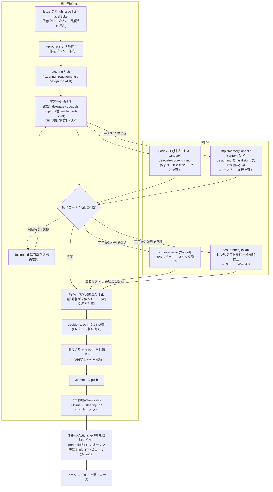

# claude-codex-template

スペック駆動開発・ハーネスエンジニアリング・Codex 併用委託をひとつにした Claude Code プロジェクトテンプレート。

- **スペック駆動開発** — 永続ドキュメント(`docs/`)で「何を作るか」を決め、作業単位のステアリングファイル(`.steering/`)で「今回何をするか」を計画してから実装する
- **ハーネスエンジニアリング** — hooks / permissions / git hooks / CI で「必ず起こすべきこと」を仕組みで保証する。散文の運用ルールに頼らない
- **役割別のモデル運用** — 司令塔は Opus 固定。実装フェーズは Codex 委託(既定)か Sonnet の fork(フォールバック)に切り出し、**ユーザーもモデルも手で切り替えない**

> このリポジトリは**テンプレート本体**です。ここから作ったプロジェクトでは、`/kickoff` フェーズ5 が `docs/template-dev/` とテンプレート由来の `.steering/` を削除し、この README をプロダクトの README に書き換えます。

---

## 1. プロジェクト開始手順

> **最短ルート**: Step 0 を済ませたら、アイデアを `docs/ideas/initial-requirements.md` に書いて **`/kickoff`** を実行する。Step 1〜4 と README のプロダクト化までを対話的に一気通貫でガイドする。

### Step 0: リポジトリの準備

1. GitHub で **Use this template** から新規リポジトリを作成する
   - (配布側の設定: Settings → General で **Template repository** を有効化しておく)
2. Settings → Secrets and variables → Actions に **`CLAUDE_CODE_OAUTH_TOKEN`** を設定する
   - 未設定の間、PR 自動レビューと `@claude` メンションの Actions はスキップされる(失敗はしない)
   - **スキップしてもジョブは `success` を返す。** 緑のチェックはレビュー通過を意味しない(未実行であることは run の annotation と Summary に出る)
   - 機械的な品質ゲート(`ci.yml`)はシークレット不要で常に走る
3. Settings → Code security で **Secret scanning + Push protection** を有効化する(公開リポジトリなら無料)
   - リポジトリ内の secretlint(pre-commit / CI)と合わせた二段構えになる
4. devcontainer で開く(VS Code / GitHub Codespaces)
   - `.devcontainer/post_create.sh` が Claude Code のインストールと GitHub 認証を行う(GitHub は OS の環境変数から認証。Claude Code の認証は初回 `claude` 実行時に一度だけ走る)
   - Codex CLI も同時に入る。**認証は初回と devcontainer リビルドのたびに手動**で `codex login` を実行する(通らなければ `codex login --device-auth`)。`~/.codex` はコンテナ内にしか無く永続化していない
     - `--with-api-key` は使わないこと(ChatGPT Plus 枠ではなく API 従量課金になる)
   - devcontainer の表示名(`devcontainer.json` の `name`)は `/kickoff` フェーズ5 がプロダクト名に書き換える
5. ターミナルで `claude` を起動し、以下を確認する
   - `/model` が **Opus** になっていること(`.claude/settings.json` で司令塔として固定済み)
   - `gh auth status` が認証済みであること

**テンプレート既定のスタック**: Node.js v24(devcontainer / CI / `engines` で固定)・TypeScript 6.x・npm・ESLint・Prettier・Vitest・secretlint・husky。アイデアの技術選定が異なる場合は `/kickoff` フェーズ1 が置換をタスク化する。

| npm script                                  | 内容                  |
| ------------------------------------------- | --------------------- |
| `npm run lint` / `lint:fix`                 | ESLint                |
| `npm run typecheck`                         | `tsc --noEmit`        |
| `npm run format` / `format:check`           | Prettier              |
| `npm test` / `test:watch` / `test:coverage` | Vitest                |
| `npm run build` / `dev`                     | `tsc` / `tsc --watch` |

### Step 1: アイデアの言語化

作りたいものの構想を **`docs/ideas/initial-requirements.md`** に書く(見出し構造の雛形が用意済み)。全項目を埋める必要はない。空欄は `/setup-project` の対話で補完される。

### Step 2: 永続ドキュメントの作成 — `/setup-project`

対話形式で以下の 6 つを **1 ファイルずつ、承認を取りながら** `docs/` に作成する。

| ドキュメント                | 内容                                                 |
| --------------------------- | ---------------------------------------------------- |
| `product-requirements.md`   | プロダクト要求定義書(何を作るか・ユーザーストーリー) |
| `functional-design.md`      | 機能設計書(機能の振る舞い)                           |
| `architecture.md`           | 技術仕様書(技術スタック・非機能要件)                 |
| `repository-structure.md`   | リポジトリ構造定義書                                 |
| `development-guidelines.md` | 開発ガイドライン(規約・検証コマンド)                 |
| `glossary.md`               | ユビキタス言語定義                                   |

詳細なレビューが必要なときは `/review-docs docs/product-requirements.md` のように依頼する。

画面を作るプロジェクトでは、テンプレート同梱の `docs/ui-design-guidelines.md`(スタック非依存の UI 品質基準)と `docs/ui-design-request-template.md`(デザイン依頼のプロンプト雛形)を併用する。ガイドライン §7「実装への翻訳」表は `/kickoff` フェーズ1.5 がスタックに合わせて記入する。

### Step 3: 実装計画の分割(任意)

```
> /setup-spoke-standards    # スポーク公開向けの構成ルールを生成(必要な場合のみ。先に実行)
> /setup-tickets            # 永続ドキュメントを段階的な実装チケットに分割 → GitHub Issues に発行
```

**順序は固定** — `/setup-spoke-standards` を使う場合は `/setup-tickets` の**前**に実行する。構成ルールの MUST 項目(セキュリティヘッダ・SEO・レジストリメタデータ等)がチケットの受け入れ条件になるため、後から生成すると発行済みチケットを作り直すことになる。

**`/setup-spoke-standards` はどこで実行するか** — ハブ&スポーク構成(一覧する**ハブ** + そこから飛ぶ独立サイト/ゲーム = **スポーク**)のときだけ使う。

- **実行する場所はハブ側のリポジトリ**(このテンプレートで開始したプロジェクト本体)。ハブのレジストリスキーマ・ドメイン規約・既存の `_headers` などを読んでルールを具体化するため
- 生成物は `docs/playbook/spoke-development-standards.md` と、そこへの参照を `CLAUDE.md` に追記したもの
- **スポーク側リポジトリでは実行しない。** スポークは 1 リポジトリ = 1 サブドメインの独立リポジトリで、ハブ側で生成したこのルールを**読んで従う**側になる
- ハブ&スポーク構成でないプロジェクトでは実行不要

チケットは GitHub Issues(`ticket` + 優先度ラベル)で管理する。ステータス更新のコミットが不要になり、PR の `Closes #N` でマージ時に自動クローズされる。並行作業でもチケット状態が競合しない。

### Step 4: ハーネス層の追加 — `/harness-setup`

検証コマンド(lint / typecheck / test)が確定したら実行する。スラッシュコマンドではなく**スキル**(`.claude/skills/harness-setup/`)として提供されているが、呼び出し方は同じ。

```
> /harness-setup
```

対話形式で以下を生成・統合する。

- **CLAUDE.md への「ハーネス」節追記**(検証コマンド・必須ルール・委譲ルール)
- **settings.json の統合**(危険コマンドの `permissions.deny`・PostToolUse の整形/lint hook は既定で導入済み。プロジェクト固有の deny パターンや hook をここで統合する)
- **worker subagents**(既定の 5 体は導入済み。security-reviewer 等を必要に応じて追加する)
- **Agent Teams の有効化**(任意・experimental)と `.harness/` の整備

Agent Teams を有効化した場合は、`/config` で **Default teammate model を Sonnet** に設定し、Claude Code を再起動して環境変数を反映する。

### Step 5: 開発サイクル

基本は普通に会話で依頼すればよい。定型フローにだけコマンドを使う。

```
> /status                                # 現在地の確認と次の一手の提案
> /next-ticket                           # 次のチケットに着手(ラベル管理込み)
> /autopilot                             # チケット消化を自動進行(事前チェック → 問題なければ裏で開始)
> /fix-pr 42                             # 既存 PR のコンフリクト・CI 失敗・レビュー指摘を直す
> /add-feature ユーザープロフィール編集   # 機能追加(計画→実装→検証→PR まで)
> /fix-issue 42                          # GitHub Issue の修正と PR 作成
> /check                                 # lint・型チェック・テスト・フォーマット一括実行&自動修正
> /commit                                # 変更を適切な粒度でコミット
> /resume-work                           # 中断した .steering/ の作業を再開
> /sync-docs                             # 実装と docs/ の乖離を検出・更新
```

作業計画・実装・振り返りは `steering` スキルが `.steering/[YYYYMMDD]-[タスク名]/` に記録する(`/next-ticket` などが内部で使用)。

---

## 2. 実運用フロー

### プロジェクトライフサイクル



### チケット 1 件の実装フロー(委譲構造)

司令塔(Opus)は判断と統合に専念し、ログの長い作業とレビューは委託先に出す。



### 運用上のポイント

- **広範囲のコード探索**は組み込みの Explore サブエージェントに委譲し、司令塔は結論だけ受け取る。`/sync-docs` も乖離検出フェーズを読み取り専用サブエージェントに委譲する
- **実装フェーズの委譲は hook で強制される。** 最新 `.steering/` の `tasklist.md` に未完了タスクがある状態で司令塔が実装コードを Edit/Write しようとすると、`check-implementation-phase.sh` がブロックする。`.steering/` / `docs/` / `.claude/` / `.github/` / `.husky/` への編集は司令塔の仕事なので通る
  - 検査対象は **Edit / Write ツール**。`sed -i` やリダイレクトによる Bash 経由の書き込みまでは見ていない(逸脱を止めるガードレールであって、サンドボックスではない)
  - 「最新の `.steering/`」の判定は `.claude/scripts/latest-steering.sh` に集約してある。hook・fork・SessionStart が同じディレクトリを指すことが前提なので、**自前で `ls | sort` しないこと**
  - テンプレート自体の改修など司令塔が実装すべき作業では、`tasklist.md` に `<!-- main-edit-ok -->` を書いて解除する。**このマーカー付きの `.steering/` をプロダクト側に残さないこと**(`/kickoff` フェーズ5 が削除する)
- **共通ルールは 2 層。** `.claude/rules/*.md` は `CLAUDE.md` 経由で**全サブエージェントにも毎回ロードされる**ため、実装者・レビュアーにも要る内容だけを置く。司令塔だけが使うルールは `.claude/rules/lead/*.md` に置き、SessionStart hook がメインセッションにのみ注入する(SessionStart はサブエージェントでは発火しない)
- **`/clear`・resume 後は SessionStart hook が現在地を自動注入する**(ブランチとベースブランチの乖離・未コミット変更・in-progress Issue・最新 `.steering/` の未完了タスク・未検収の Codex 委託)。**チケット完了(PR 作成)ごとに `/clear`** してから次の `/next-ticket` を始めるのが、トークン消費の最大の削減ポイント
- **コンテキストは小さく保つ。** 150k を超えたら区切りで `/compact`、タスクが変わったら `/clear`。相談・調査と実装を同じセッションに混ぜない(調査ログが以降ずっと毎ターン再送される)
- **Claude Code on the web** から開いた場合、SessionStart hook が `npm install` を自動実行する(devcontainer 不要で `/check` が通る)。web のリモート環境には `gh` CLI が無いため、GitHub 操作は `mcp__github__*` で代替する
- **MCP は最小構成。** 既定は Context7(最新ライブラリドキュメント参照)のみを `.mcp.json` に登録している。追加の判断基準は `.claude/docs/mcp-introduction-guide.md`、serena の再導入は `.claude/docs/serena-reintroduction.md`
- **PR ボディは `.github/pull_request_template.md`** に従う(`Closes #N` と `.steering/` ディレクトリ名を記録する)

### チケット消化の自動進行(`/autopilot`)

`/next-ticket` → `/clear` の繰り返しを自動化する。人間向けの手順書は **`.claude/docs/autopilot-guide.html`**(ブラウザで開く)。

- **判定は `.claude/scripts/autopilot-next.sh` が毎回行う**(REST のみなのでクラウドでも動く)。優先順は 要対応 PR(コンフリクト / CI 失敗 / 変更要求)の修復 → 空き枠があれば依存(`depends: #N`)が解決済みのチケットに着手 → 待機。**レビュー待ちの PR は待つ(マージは人間)が、その間も `maxInFlight`(`.claude/autopilot.json`、既定 2)まで独立チケットを並行して進める**
- **ローカル**(推奨): Claude Code で **`/autopilot`** を実行すると事前チェック(`autopilot-preflight.sh`)が走り、全部 ✅ なら裏で起動、⚠️ なら確認、❌ なら直し方を示して起動しない(`/autopilot check` / `status` / `stop` もある)。ターミナルからは `bash .claude/scripts/autopilot-loop.sh --background`(起動前に同じチェックが走る。ログは `--log`、停止は `--stop`)。1 周ごとに `claude -p` を新プロセスで起動し(= `/clear` 相当)、待機中はシェルが眠るだけで枠を消費しない
- **全体管理 Issue**(`autopilot` ラベル、自動作成): 全チケットの状態を一覧し、本文のチェックで一時停止・再開できる。人手が要る停止は理由がコメントされる。状態の正は各チケットのラベル・PR のままで、この Issue は表示と操作だけ
- **econ(モード B)でも動く**(ローカルのみ): 計画だけ `claude -p` → 実装はループがシェルから Codex に委託 → draft PR だけ `claude -p`(`/ship-ticket`)。検収は CI に委ね、`package.json` のライフサイクル差分があれば止まる。degraded では止まる
- **クラウド**: 司令塔セッションがチケットごとに子セッションを起動する(コンテナ・ブランチ・コンテキストが別)。子は PR を購読して CI・レビューに対応し、作成・マージを親に通知する

### ブランチ戦略(単一ソース = `.claude/branch-policy.json`)

機械が読む値はポリシーファイルだけを正とする。テンプレート既定は GitHub Flow(`baseBranch: main` / 保護ブランチは `main` / 許可プレフィックスは `feature/` `fix/` `release/` `hotfix/` `claude/` `dependabot/`)。

保護ブランチ上での作業は禁止で、層は**強制 3 層 + 情報提供 1 層 + 別軸の最終検証**。保護ブランチ判定の実体は `.claude/scripts/check-protected-branch.sh` に一本化してあり、経路によらず同じ結果になる。

| 層                   | 実体                                | 効く範囲                                                                   |
| -------------------- | ----------------------------------- | -------------------------------------------------------------------------- |
| 情報提供(阻止しない) | SessionStart hook                   | 現在のブランチとポリシー上のベースを注入する                               |
| 強制 1               | PreToolUse `check-branch-policy.sh` | 直接コミットと `gh pr create --base` の誤りをブロック。**Claude 経由のみ** |
| 強制 2               | `.husky/pre-commit`                 | `git commit` / `--amend`。**ベンダー非依存**                               |
| 強制 3               | `.husky/prepare-commit-msg`         | `git revert` / `git cherry-pick`。**`--no-verify` で迂回できない唯一の層** |
| 最終検証(別軸)       | CI の `branch-policy` ジョブ        | クライアント非依存。ただし見るのは PR の base とブランチ名だけ             |

- `git merge` / `git pull` の取り込みだけを通す。判定には第 2 引数ではなく **`.git/MERGE_HEAD` の有無**を使う(`git revert -e` / `git cherry-pick -e` も第 2 引数に `merge` を渡してくるため、引数だけで素通しにすると保護ブランチ上ですり抜ける)
- **アプリ/web のリモートセッションは `claude/*` ブランチが先に作られた状態で始まる。** `feature/*` と同格の正規ブランチとして扱い、**リネームしない**(セッションとの紐付けが壊れる)
- リモートセッションはプラットフォーム既定ブランチ起点で作られるため、`baseBranch` が `develop` のプロジェクトでは乖離する。PR 作成前に `git merge origin/[baseBranch]` で追従し、`gh pr create --base [baseBranch]` を必ず明示する

---

## 3. 自動化層の一覧

### Claude Code の hooks(`.claude/settings.json`)

| 契機                    | 実体                                                 | 役割                                                                                                                                                                                       |
| ----------------------- | ---------------------------------------------------- | ------------------------------------------------------------------------------------------------------------------------------------------------------------------------------------------ |
| SessionStart            | `.claude/hooks/session-start.sh`                     | リモート環境での `npm install` / 現在地の注入 / 司令塔専用ルール(`rules/lead/`)の注入 / モード別ルール(`rules/mode/`)の注入 / 未検収 Codex 委託の注入 / ハーネスの自壊検知(実行権限の欠落) |
| PreToolUse(Bash)        | `block-dangerous-cmds.sh` → `check-branch-policy.sh` | 危険コマンドのパターン検査、保護ブランチとベース指定の検査                                                                                                                                 |
| PreToolUse(Edit/Write)  | `check-implementation-phase.sh`                      | 実装フェーズ中の司令塔による実装コード編集をブロック                                                                                                                                       |
| PostToolUse(Write/Edit) | prettier(インライン)→ `lint-on-edit.sh`(async)       | 保存のたびに整形し、lint と型チェックを非同期で先行実行する                                                                                                                                |

危険コマンドは `permissions.deny`(`npm publish` / `git push --force` 等)とパターン検査の二段構え。`npm install` は `ask` にしてある。

### git hooks(ベンダー非依存 / `.husky/`)

`pre-commit` は保護ブランチ検査 + `lint-staged`(ESLint / Prettier / secretlint)、`prepare-commit-msg` は `git revert` / `git cherry-pick` の検査。**Codex・手動 git・他の AI ツールにも効く。**

### GitHub Actions

| ワークフロー                | 起動条件                                                                | 内容                                                                                                                                                                          | シークレット                  |
| --------------------------- | ----------------------------------------------------------------------- | ----------------------------------------------------------------------------------------------------------------------------------------------------------------------------- | ----------------------------- |
| `ci.yml`                    | `main` / `develop` への push と**全 PR**                                | `branch-policy`(ベースとブランチ名)/ `harness-integrity`(ガードレール健全性・委託禁止領域の記述乖離)/ `quality`(lint・typecheck・format:check・test・secretlint・`npm audit`) | 不要                          |
| `record-hygiene.yml`        | PR の opened / synchronize / reopened / edited / labeled / unlabeled    | CHANGELOG と `.harness/decisions.jsonl` の記録漏れを検査                                                                                                                      | 不要                          |
| `claude-code-review.yml`    | **`main` 向け** PR の opened / ready_for_review(**draft では走らない**) | Claude による自動レビュー                                                                                                                                                     | `CLAUDE_CODE_OAUTH_TOKEN`     |
| `claude.yml`                | `@claude` メンション(OWNER / MEMBER / COLLABORATOR のみ)                | 指示に応じた作業                                                                                                                                                              | 同上                          |
| `template-update-check.yml` | 毎月 1 日 + 手動実行                                                    | テンプレート側の未取り込み更新を検出して Issue を立てる                                                                                                                       | 不要(**Claude を起動しない**) |

**CI は Claude の枠を一切消費しない**ので、機械的検証はできるだけ CI に寄せる。`record-hygiene.yml` を `ci.yml` に同居させていないのは、ラベル操作のたびに `npm ci` から再実行させないため。

### 記録の義務と逃げ道ラベル

| 検査                             | 落ちる条件                                                                                                  | 逃げ道ラベル         |
| -------------------------------- | ----------------------------------------------------------------------------------------------------------- | -------------------- |
| `docs/template-dev/CHANGELOG.md` | `.claude/` / `.husky/` / `.codex/` / `.github/workflows/` / `AGENTS.md` を変更した PR で CHANGELOG が未更新 | `no-changelog`       |
| `.harness/decisions.jsonl`       | PR が `ticket` ラベル付き Issue を `Closes #N` でクローズするのに該当行が無い                               | `no-decision-record` |

`decisions.jsonl` は**削除禁止・追記のみ**の永続ログで、**PR を出す前**(検収が終わり往復回数と指摘数が確定した時点)に書く。マージ後に回すと記録そのものが落ちる。逃げ道ラベルは理由を添えて付けるもので、既定の回避手段ではない。判定の実体は `.claude/scripts/check-record-hygiene.sh` にあり、環境変数を渡せば手元でも同じ結果を再現できる。

### 品質チェックの三層

同じ内容を繰り返し回さないための切り分け。

| 層                 | 範囲                                           | 担当                           |
| ------------------ | ---------------------------------------------- | ------------------------------ |
| 実装直後の自己修復 | 変更したファイルの lint・型・関連テスト        | 委託先(Codex / Sonnet fork)    |
| 検収               | フルスイート 1 回                              | `test-runner`(Haiku)= `/check` |
| 最終ゲート         | フルスイート + secretlint + ガードレール健全性 | CI                             |

`/check` を「実装中に即時フィードバックが要る局面」以外で繰り返し回さない。

---

## 4. Codex 併用の委託運用

Claude の週枠を守るため、実装・調査・レビューの一部を **Codex CLI(ChatGPT Plus 枠)** に委託できる。委託の入口は `.claude/scripts/delegate-codex.sh` の 1 本だけで、司令塔は**終了コードだけを見て**分岐する(サマリーの文面から成否を推測しない)。

### 終了コードの契約

| コード    | 意味                                                 | 司令塔の動き                                                 |
| --------- | ---------------------------------------------------- | ------------------------------------------------------------ |
| 0         | 完了                                                 | 検収(`code-reviewer` + `test-runner`)へ                      |
| 1         | 判断待ち                                             | `design.md` に判断を追記して再委託                           |
| 2         | 失敗(タスク起因・使い方の誤り)                       | 原因分析                                                     |
| 3         | Codex 利用不可(CLI 不在・未認証・依存未インストール) | **そのセッションは以降ずっと** Sonnet fork にフォールバック  |
| 4         | Codex 側のレート上限                                 | 一時フォールバック(待つ or Sonnet fork)                      |
| 5         | 計画が未完成(`design.md` が draft のまま)            | 計画を書き切る                                               |
| 130 / 143 | 割り込み(SIGINT / SIGTERM)                           | 「結果」ではなく「中断」。run record は `running` のまま残る |

3 と 4 を混ぜないこと。前者は環境の欠落(恒久)、後者は枠切れ(一時)で回復手段が違う。

### 委託モード(実装済み 3 種)

| 呼び出し                                   | 権限            | 内容                             |
| ------------------------------------------ | --------------- | -------------------------------- |
| `delegate-codex.sh explore <調査指示>`     | read-only       | 広域コード探索。サマリーのみ返す |
| `delegate-codex.sh review <base-ref>`      | read-only       | 敵対的レビュー。指摘リストを返す |
| `delegate-codex.sh impl <.steering/[dir]>` | workspace-write | 実装フェーズの委託               |

並行数は **impl が 1 本まで**(同一ワーキングツリーを共有するため、入口検査が機械的に止める)。read-only の explore / review は並行できる。生ログと run record は `.harness/codex-runs/` に落ち、`.claude/scripts/codex-run.sh`(`list` / `pending` / `show` / `accept` / `set-status` / `prune`)で扱う。

### 運用モード(切替を宣言するのは人間)

| モード  | `.harness/mode`   | 使いどころ        | Claude の役割                                                                                   |
| ------- | ----------------- | ----------------- | ----------------------------------------------------------------------------------------------- |
| A(通常) | 未設定 / `normal` | 週枠に余裕がある  | 計画・検収・統合をすべて行う                                                                    |
| B(節約) | `econ`            | 週枠を温存したい  | `design.md` を書き切ったら閉じる。検収は CI に預け、PR は **draft** で積む                      |
| C(縮退) | `degraded`        | Claude が使えない | 不在。Codex が `.codex/skills/degraded-mode-ticket/` に従って単独で走り、成果をキューとして積む |

**`.harness/mode` は Claude が自分で書き換えない。** 読み取りの唯一の経路は `.claude/scripts/harness-mode.sh`(優先順位は `CODEX_HARNESS_MODE` > `.harness/mode` > `normal`)。モードごとの司令塔の作法は `.claude/rules/mode/*.md` が SessionStart で注入される。

- **モード B** の draft は作法ではなく節約の実体。`claude-code-review.yml` は `draft == false` のときだけ走るため、draft のままならレビューが起動しない。一方 `ci.yml` は draft でも走る。**作業ブランチへの push だけでは CI は走らない**ので、「CI が緑なら PR を作る」は因果が逆になる
- **モード C からの復帰**では、まず次を回す。縮退中は `.git` が書き込み可能な唯一の経路で、`core.hooksPath` の書き換え・`.git/hooks/` への直書き・禁止領域を触ったコミット・`Codex-authored` を名乗らないコミットを検出する

```bash
bash .claude/scripts/check-guard-integrity.sh degraded && echo "ガードレール健全"
```

- **委託を挟んだ差分では `git diff -- package.json` を目視する。** `scripts` / `lint-staged` / `prepare` は委託成果をホスト上・ネットワーク有効で実行する経路で、sandbox はここを守らない

### 委託の粒度と `delegate:codex` ラベル

判定軸はモデルの賢さではなく**往復コスト**で、「仕様が書き切れているか × 途中で設計判断が発生するか」で決める。ルールの全文は `.claude/rules/lead/delegation-policy.md`(司令塔にのみ注入される)。

| 粒度                                | 経路                                                                                              |
| ----------------------------------- | ------------------------------------------------------------------------------------------------- |
| tasklist 1〜3 項目                  | `delegate-codex.sh impl`                                                                          |
| **チケット 1 枚**(1 Issue = 1 PR)   | 同上 + Issue に **`delegate:codex`** ラベル。`/next-ticket` が tasklist を分割せず 1 回で委託する |
| 行き詰まり調査 / 重要変更のレビュー | `delegate-codex.sh explore` / `review`(read-only)                                                 |
| 委託しない                          | 委託禁止領域・新規依存の追加(sandbox はネットワーク無効)・`.git` を書き換えるタスク               |

> **委託は「`design.md` を書き切るコスト」<「実装ループのコスト」のときだけ得になる。** 新規パターンの 1 例目は前者が大きいので委託しない(参照実装は司令塔が書く)。

ラベルは条件が明らかなときの発行時、または `design.md` を書き切った時点で付ける。計画中に禁止領域・新規依存・未確定の設計判断が判明したら外す。`exit 3`(Codex 利用不可)では外さない。

### 委託禁止領域と denylist(別の層)

事故のコストが高い領域は**パスで**列挙して委託対象から外す。対象は 3 系統 —— 実行される実体(`.claude/scripts/` `.claude/hooks/` `.husky/` `.github/workflows/`)、コンテキストへ注入される実体(`.claude/rules/` `CLAUDE.md` `AGENTS.md` `.mcp.json`)、全層が読む判定データ(`.claude/branch-policy.json` `.harness/mode` `.harness/codex-runs/`)。全量は次で出る。

```bash
bash .claude/scripts/delegate-codex.sh --print-forbidden
```

単一ソースは 2 系統で、**追加・変更はこの 2 箇所だけを直す**。汎用項目は `delegate-codex.sh` の `FORBIDDEN_PATHS`、プロジェクト固有パス(認証・決済・データ移行などの実パス)は `AGENTS.md` §4 のマーカー内。委託の出口検査が両方を抽出してマージし、前後の内容ハッシュ差分を `exit 2` で止める。CI の `harness-integrity` が `.claude/rules/lead/delegation-policy.md` との記述乖離を双方向で照合する。

**`.claude/codex-denylist.txt`(機密の送信禁止)とは別の層。** denylist は該当ファイルが存在するだけで委託を止めるフェイルクローズ検査で、モジュールパスを入れると全委託が止まる。守るのは**ワークツリー内だけ**で、ホーム配下の資格情報は検査対象にすらならない(環境変数経由の漏れは `env -i` + 明示した変数だけを渡す許可リストで別途塞いである)。

### Codex を使わない場合

Codex CLI が無い・未認証の環境では `delegate-codex.sh` が `exit 3` を返し、**そのセッションは以降ずっと `implement-ticket`(Sonnet fork)にフォールバックする**。`delegate:codex` ラベルが付いていても同じで、テンプレートの全フローは Codex 無しで成立する。

---

## 5. モデル運用方針

| 役割                     | モデル                | 備考                                                                                                                                                |
| ------------------------ | --------------------- | --------------------------------------------------------------------------------------------------------------------------------------------------- |
| 司令塔(メインセッション) | **Opus**              | 計画・設計判断・統合・報告。`.claude/settings.json` で固定済み                                                                                      |
| 実装フェーズ             | **Codex / Sonnet**    | 既定は Codex(`delegate-codex.sh impl`)。使えなければ `implement-ticket` スキル(`context: fork`)が Sonnet で実行。**ユーザーもモデルも切り替えない** |
| 委譲作業(subagent)       | **Sonnet**            | `implementer` / `code-reviewer` / `implementation-validator` / `doc-reviewer` / 組み込みの Explore                                                  |
| 品質チェック実行         | **Haiku**             | `test-runner`。lint・テスト実行と機械的修正、サマリーのみ返す                                                                                       |
| 最難関タスク             | **Fable 5**(一時切替) | 難度の高い設計・原因不明の調査のみ。`/model fable` → 完了後 `/model opus`                                                                           |

### 実装フェーズを司令塔から切り離す理由

トークン消費が最も大きいのは「実装 → テスト → エラーを読む → 修正」のループで、ここを司令塔の外で回すのが上限消費を減らす最大の手段になる。手動で `/model` を切り替える運用は、**切替前の `/clear` を忘れると膨らんだコンテキスト全体がキャッシュミスとなり全額課金される**という失敗モードを持っていた。

そこで実装フェーズを委託に切り出している。**委託先が変わっても司令塔の分岐(完了 / 判断待ち / 失敗)は同じ**であることが設計要件。

- **Codex 委託**: 実装ループは別プロセスで回り、司令塔には終了コードとサマリーだけが返る。Claude の枠を消費しない
- **Sonnet fork**: `context: fork` + `model: sonnet` により、フォークされた subagent が実装する。司令塔は Opus のまま。長いログは fork 側で完結し、サマリー 20 行だけが返る
- fork は会話履歴を持たず `design.md` / `tasklist.md` だけを読む。**計画の粒度がそのまま往復コストになる。** 1 チケットで往復が 2 回を超えたら `design.md` の粒度不足のサイン
- 司令塔が委譲を迂回して自分で実装しようとすると、PreToolUse hook がブロックする
- **参照実装は司令塔が書く。** P0 の基盤や新パターンの 1 例目は品質のレバレッジが最大なので、`design.md` に実装内容を書き切る形で司令塔が主導する。2 例目以降の横展開が委託の主戦場

### レビューの使い分け

- **実装中(主レビュー)**: `code-reviewer` subagent(read-only / Sonnet)。`docs/` とのスペック整合もここで確認する
- **PR 時(最終ゲート)**: `main` 向け PR のオープン時 / ready_for_review 時に 1 回だけ自動で走る。push ごとの再レビューは無い。必要なときは PR 上で `@claude` にメンションする
- **200 行以上 かつ 重要変更**(認証・決済・データ移行・アーキテクチャ変更): **既定は `delegate-codex.sh review`**。read-only で司令塔が自分で起動でき、別ベンダーの第二意見にもなる
  - `/code-review ultra` は**ユーザー起動 + 課金**で司令塔からは起動できない。提案するのは (1) その差分自体を Codex が書いた場合、(2) Codex が使えない場合の 2 つだけ。既定と併用しない
- **UI/画面**: `docs/ui-design-guidelines.md` §6 のチェックリストを `code-reviewer` に当てる

判断の根拠と実測値は `docs/template-dev/cost-model.md`、委託設計の根拠は `docs/template-dev/codex-delegation-plan.md`、実測の記録方法は `docs/template-dev/econ-measurement.md`。

---

## 6. コマンド早見表

| コマンド                 | タイミング                 | 内容                                                   |
| ------------------------ | -------------------------- | ------------------------------------------------------ |
| `/kickoff`               | 初回                       | Step 1〜4 + README のプロダクト化を一気通貫            |
| `/setup-project`         | 初回                       | 永続ドキュメント 6 つを対話作成                        |
| `/setup-spoke-standards` | 初回(任意・チケット発行前) | スポーク公開向け構成ルール(**ハブ側リポジトリで実行**) |
| `/setup-tickets`         | 初回(任意)                 | 実装チケットを GitHub Issues に発行                    |
| `/harness-setup`         | 初回(検証コマンド確定後)   | ハーネス層の追加(スキルとして提供)                     |
| `/next-ticket`           | 日常                       | 次のチケットに着手(ラベル管理込み)                     |
| `/autopilot`             | 日常                       | チケット消化の自動進行(事前チェック → 開始)            |
| `/fix-pr [番号]`         | 日常                       | 既存 PR の修復(コンフリクト・CI・レビュー指摘)         |
| `/ship-ticket [番号]`    | econ 自動進行が呼ぶ        | Codex の委託成果を draft PR にする(検収なし)           |
| `/add-feature [機能]`    | 日常                       | 機能追加の計画→実装→検証→PR                            |
| `/fix-issue [番号]`      | 日常                       | Issue 修正と PR 作成                                   |
| `/check`                 | 日常                       | 品質チェック一括実行&自動修正                          |
| `/commit`                | 日常                       | 適切な粒度でのコミット                                 |
| `/status`                | 随時                       | 現在地と次の一手(読み取り専用)                         |
| `/resume-work`           | 随時                       | 中断作業の再開                                         |
| `/sync-docs`             | 定期                       | 実装と `docs/` の同期                                  |
| `/review-docs [パス]`    | 随時                       | ドキュメントの詳細レビュー                             |
| `/sync-template`         | 随時(テンプレート更新時)   | テンプレートの更新差分を取り込む                       |

### スクリプト早見表(`.claude/scripts/`)

| スクリプト                                                                                                 | 役割                                                                        |
| ---------------------------------------------------------------------------------------------------------- | --------------------------------------------------------------------------- |
| `delegate-codex.sh`                                                                                        | Codex 委託の唯一の入口(`explore` / `review` / `impl` / `--print-forbidden`) |
| `codex-run.sh`                                                                                             | run record の一覧・検収・状態更新・剪定                                     |
| `harness-mode.sh`                                                                                          | ハーネスモード読み取りの唯一の経路                                          |
| `check-guard-integrity.sh`                                                                                 | ガードレール健全性(引数なし / `degraded` / `hooks-path`)                    |
| `check-protected-branch.sh`                                                                                | 保護ブランチ判定の実体(強制 3 層が共有)                                     |
| `latest-steering.sh`                                                                                       | 最新 `.steering/` の判定(hook・fork・SessionStart が共有)                   |
| `check-record-hygiene.sh`                                                                                  | CHANGELOG / decisions.jsonl の記録漏れ判定(CI と手元で同じ結果)             |
| `check-forbidden-paths-doc.sh`                                                                             | 委託禁止領域の記述乖離の双方向照合                                          |
| `autopilot-next.sh`                                                                                        | チケット自動進行の判定(`/next-ticket` / `/autopilot` / ループが共有)        |
| `autopilot-loop.sh` / `autopilot-preflight.sh` / `autopilot-board.sh`                                      | 自動進行のループ / 開始前チェック / 全体管理 Issue                          |
| `block-dangerous-cmds.sh` / `check-branch-policy.sh` / `check-implementation-phase.sh` / `lint-on-edit.sh` | hook の実体                                                                 |
| `lib-record.sh` / `lib-github.sh`                                                                          | source 専用の共有ライブラリ(**実行権限を付けない**。CI が検査する)          |

---

## 7. テンプレート更新の取り込み

このテンプレートから作ったプロジェクトは、テンプレート側でルール・コマンド・ハーネスが更新されたときに **`/sync-template`** で差分を取り込める。

- **所有権の分離**: 共通ルールは `.claude/rules/`(テンプレート所有・上書き対象)に切り出してある。全エージェント共通のものは `CLAUDE.md` が `@` インポートし、司令塔専用のもの(`lead/`)は SessionStart hook が注入する。プロジェクト固有の追記は `CLAUDE.md` の「プロジェクト固有ルール」節に書く(同期で失われない)
- **同期対象の単一ソース**: `.claude/template-manifest.json` の `owned`(上書き)/ `merge`(手動統合)/ `never`(触らない)。判定の優先順位は `owned` > `merge` > `never`。`syncedAt` に前回同期した**テンプレート側の commit SHA** を持ち、そこからの差分だけを見る(`/kickoff` フェーズ0 が初期値を刻む)
- **変更の伝達**: テンプレート側の `docs/template-dev/CHANGELOG.md` に `[auto]`(上書きで完結)/ `[manual]`(取り込む側の作業が必要)を明示する。`/sync-template` はリモートから直接読むため、`docs/template-dev/` を削除済みのプロジェクトでも機能する
- **検知**: 月次の `template-update-check` ワークフローが未取り込みの更新を検出して Issue を立てる(Claude は起動しないため枠を消費しない)

> ⚠️ `.claude/rules/`(`lead/` を含む)を直接編集しないこと。次回の `/sync-template` で上書きされる。共通ルールを変えたい場合はテンプレート側を直すか、`CLAUDE.md` に例外を書く。

### 同期未対応のプロジェクトを追いつかせる(初回ブートストラップ)

`.claude/template-manifest.json` が導入される前のテンプレートで始めたプロジェクト(手元に `/sync-template` が無い)は、**同期の起点を手で刻んでから** `/sync-template` に載せる。`/kickoff` の再実行はしないこと(ドキュメントとチケットを作り直す流れのため、開発が進んだプロジェクトには当てられない)。

作業ツリーをクリーンにしてから、プロジェクト側リポジトリで実行する。`<テンプレートリポジトリの URL>` には出発点にしたテンプレートの URL を入れる。

```bash
git switch -c chore/sync-template-$(date +%Y%m%d)
git remote add template <テンプレートリポジトリの URL>
git fetch template main --quiet
git checkout template/main -- .claude/commands/sync-template.md .claude/template-manifest.json
```

取り込んだ `.claude/template-manifest.json` の `syncedAt` に、**そのプロジェクトが出発点にしたテンプレート側の commit SHA**(`syncedDate` にはその日付)を書く。`null`(初回扱い)のままだと差分抽出が全ファイル比較になり、CHANGELOG も全期間が対象になる。SHA が分からない場合は、プロジェクトの最初のコミット日以前で最も近いテンプレート側のコミットを使う。同じファイルの `templateRepo` が以降の同期元になるので、値が正しいかもここで確認する。

あとは Claude Code を再起動して(コマンド定義の読み込みのため)`/sync-template` を実行する。以降は通常の同期フローに乗る。

古い出発点ほど CHANGELOG の `[manual]` が積み上がっている。特に以下は取りこぼしやすい。

- **`CLAUDE.md` のルール分離**: 共通ルールがインラインで書かれている世代なら、該当節を削除して `@.claude/rules/spec-driven.md` の 1 行に置き換える。司令塔専用ルールは SessionStart hook が注入するので `@` インポートは不要
- **手動 `/model sonnet` 運用の削除**: 実装フェーズは委託に変わった。`docs/development-guidelines.md` 等に手動切替を書いていれば消す
- **`AGENTS.md` の検証プローブ**: `<!-- verify-probe: ... -->` は `exists <リポジトリ相対パス>` 形式が既定(Node 系なら `exists node_modules/.bin/eslint`、Python 系なら `exists .venv/bin/<ツール名>`)。旧形式の `npx --no-install ... --version` はホスト上で実行される経路が残る
- **委託禁止領域の `.husky/` 統合**: `AGENTS.md` §4 に `pre-commit` / `prepare-commit-msg` の個別記述が残っていれば `.husky/` の 1 行に置き換え、`.claude/settings.local.json` の行も足す
- **`.claude/settings.json`**(`merge` 対象なので上書きされない): `hooks` の各エントリと `permissions.allow` への追加分を自分の配列に手で足す

最後に `chmod +x .claude/hooks/*.sh .claude/scripts/*.sh` → `/check` → `/commit` → PR。hooks / scripts / `settings.json` が入れ替わるため、**反映には Claude Code の再起動が必要**。

---

## 8. ディレクトリ構造

```
docs/                  永続ドキュメント(プロジェクトの北極星。/setup-project が生成)
├── ui-design-guidelines.md       UI 品質基準(スタック非依存。同梱ガイド)
├── ui-design-request-template.md AI に画面デザインを依頼するプロンプト雛形
├── ideas/             下書き・アイデア(開始の起点は initial-requirements.md)
└── template-dev/      テンプレート開発の記録・CHANGELOG・コストモデル(開発開始後は削除可)
.steering/             作業単位の計画・タスクリスト(履歴として保持。テンプレート由来のものは /kickoff で削除)
.harness/              ハーネス状態
├── decisions.jsonl    横断的な判断ログ(削除禁止・追記のみ。コミットする)
├── mode               運用モード(normal / econ / degraded。切替は人間が宣言。gitignore 済み)
└── codex-runs/        Codex 委託の run record と生ログ(gitignore 済み)
AGENTS.md              Codex 向けの規約(Codex は CLAUDE.md も hooks も読まないため、写像はここだけ)
CLAUDE.md              プロジェクトメモリ(全エージェントに毎回ロードされる)
.codex/
├── config.toml        Codex CLI のプロジェクト設定(防衛線ではない)
└── skills/            Codex 用ワークフロー(モード C = 縮退運用の単独完走手順)
.husky/                ベンダー非依存の git hook(pre-commit / prepare-commit-msg)
.claude/
├── agents/            サブエージェント定義(implementer / code-reviewer / implementation-validator / doc-reviewer は Sonnet、test-runner は Haiku)
├── skills/            スキル(implement-ticket / steering / harness-setup / 各ドキュメント作成ガイド)
├── commands/          スラッシュコマンド(15 本)
├── rules/             全エージェント共通ルール(テンプレート所有。CLAUDE.md が @ インポート)
│   ├── lead/          司令塔専用ルール(SessionStart hook が注入。サブエージェントには載らない)
│   └── mode/          モード別の司令塔ルール(normal 以外のときだけ注入)
├── scripts/           hook の実体・共通判定ロジック・Codex 委託経路
├── hooks/             SessionStart hook
├── docs/              恒久参照ガイド(MCP 導入・serena 再導入。プロジェクト開始後も残す)
├── branch-policy.json      ブランチ戦略の機械可読な単一ソース
├── codex-denylist.txt      Codex 委託の送信禁止パターン
├── template-manifest.json  テンプレート追従の所有権マニフェスト
└── settings.json           モデル固定・権限・hooks
.github/workflows/     CI・Claude レビュー・記録検査・テンプレート更新検知
```

---

## 免責事項

- **危険コマンドのブロックはベストエフォート**: `permissions.deny` と `block-dangerous-cmds.sh` は文字列パターンによる防衛線であり、サンドボックスではない。変数展開等による迂回は原理的に防げないため、本当の境界は permission mode と実行環境の隔離(devcontainer / リモート環境)が担う
- **委託先のガードレールも同様**: 委託禁止領域・denylist・出口検査は事故を減らす層であって、敵対的な相手への防御ではない。`Codex-authored` トレーラーは自己申告で、検出はできても強制はできない
- **AI レビューは人間のレビューを代替しない**: Claude による自動レビュー(PR レビュー・code-reviewer subagent)は見落としがありうる。マージ判断と生成物の最終的な検証責任は利用者にある
- **利用料金は利用者の負担**: GitHub Actions の実行時間、Claude / Codex のトークン消費は、このテンプレートの構成によって発生する。各 Actions には `timeout-minutes` を設定済みだが、コストの監視は利用者が行う
- 本テンプレートは MIT ライセンスに基づき**無保証**で提供される

## ライセンス

[LICENSE](./LICENSE) を参照。
