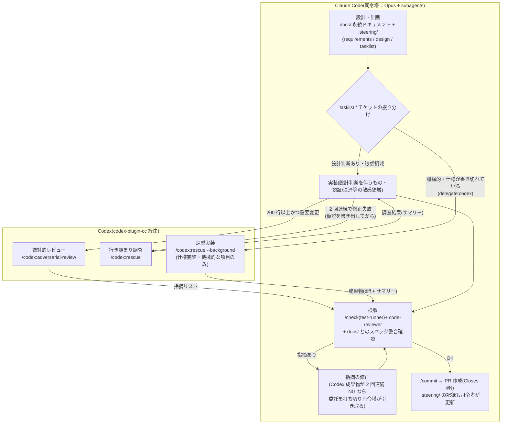

# Codex 委託の統合案(codex-plugin-cc 導入前提)

OpenAI 公式の Claude Code プラグイン [`openai/codex-plugin-cc`](https://github.com/openai/codex-plugin-cc) を導入する前提で、このテンプレートに Codex 委託の仕組みを組み込むための対応案。

- ステータス: 提案(未実装)
- 前提調査日: 2026-07-19

---

## 1. プラグインの実態(調査結果)

| 項目 | 内容 |
| --- | --- |
| 提供コマンド | `/codex:review`(読み取り専用レビュー、`--base <ref>` 対応)/ `/codex:adversarial-review`(設計判断への敵対的レビュー)/ `/codex:rescue`(タスク委譲。`--background` 対応)/ `/codex:transfer`(セッションを永続 Codex スレッド化)/ `/codex:status` `/codex:result` `/codex:cancel`(バックグラウンドジョブ管理)/ `/codex:setup` |
| subagent | `codex:codex-rescue`(司令塔が Agent tool から自律起動できる。スレッド再開に対応) |
| 実行経路 | ローカルの Codex CLI + Codex app server 経由。既存の Codex 認証・`~/.codex/config.toml`・MCP 設定をそのまま使う |
| 設定 | プロジェクトルートの `.codex/config.toml` で model / reasoning_effort 等を上書き可能 |
| 認証・前提 | ChatGPT サブスク(Free 可)or OpenAI API キー。Node.js 18.18+。使用量は Codex 側のリミットに計上 |
| review gate | Stop hook で Claude の応答完了時に Codex レビューを強制挟み込みできる(既定無効)。有効化すると Claude/Codex の長いループでリミットを速く消費すると公式が警告 |
| 導入 | `/plugin marketplace add openai/codex-plugin-cc` → `/plugin install codex@openai-codex` → `/reload-plugins` → `/codex:setup` |

### 前回案(プラグインなし)からの変更点

- **自作の `/delegate-codex` ラッパースキルは不要**。委譲・バックグラウンド管理・結果回収はプラグインが提供する
- **git worktree の手動分離は不要**。ただし同一ワーキングツリー(=ブランチも 1 つ)を共有するため、**委託中の司令塔は委託ブランチのプロダクトコードに触れない作業のみ並行する**(§4.5 の運用ルール。別チケットの実装に入るとブランチ切替で Codex の作業先が変わってしまう)
- **Codex cloud への Issue 直接アサインは第二選択に格下げ**。ローカルプラグイン経由の方が認証・設定・検収フローを一元化できる

---

## 2. 設計方針(結論)

プラグインが「実行の仕組み」を提供するので、テンプレートが足すのは **ポリシー層(いつ・何を・どの粒度で委託するか)と検収フロー** だけ。以下の 3 原則を守る。

1. **委託指示書を新設しない** — Issue ボディ(スコープ・受け入れ条件)+ `.steering/` が Codex への指示書。委託時は参照(ファイルパス)だけ渡す。**参照はファイルシステム経由で渡す**: sandbox がネットワーク無効の Codex は GitHub の Issue を取得できないため、Issue 本文は司令塔が `.steering/[dir]/requirements.md` に書き出してから、そのパスを渡す(Issue 番号だけ渡しても Codex には届かない)
2. **AGENTS.md を CLAUDE.md から派生生成する** — Codex は CLAUDE.md / hooks / permissions を読まない。守らせたい規約は AGENTS.md に写像する
3. **生成と検収のベンダー分離** — Codex の成果物は必ず Claude 側(`/check` + code-reviewer)で検収する。逆に Claude の重要変更には Codex の敵対的レビューを当てられる(クロスベンダーの相互検証)

### 役割分担の全体像(図)

設計・振り分け・検収・コミット/PR・`.steering/` の記録は**常に Claude(司令塔)**。Codex に渡るのは「定型実装」「行き詰まり調査」「敵対的レビュー」の 3 用途だけで、成果物は必ず Claude の検収を通ってからコミットされる。

ポイント:

- **左向きの矢印が 2 本ある**(敵対的レビュー・行き詰まり調査)= 一方通行の下請けではなく、クロスベンダーの相互チェック
- **Codex から `SHIP`(コミット/PR)への直行ルートは存在しない** = 検収を通らない成果物はコミットされない
- 図の `TRIAGE` の判定基準は §5 の粒度表が定義する

---

## 3. 既存レビュー・委譲体系とのマッピング

| 既存の仕組み | Codex プラグイン導入後 |
| --- | --- |
| 実装中の主レビュー: code-reviewer subagent(Sonnet) | **変更なし**(主レビューは Claude 側を維持) |
| 200 行以上かつ重要変更: `/code-review ultra` or Agent Teams 並行レビュー | **`/codex:adversarial-review` を第一候補に置き換え**。Claude トークンを消費せず、別ベンダー視点が入る。Agent Teams 並行レビューは Codex が使えない環境向けの代替に格下げ |
| 2 回連続で修正失敗 → `/model fable` へ一時切替 | **`/codex:rescue` を選択肢に追加**。同一モデル系列で行き詰まった調査は、別ベンダーへの委譲が仮説の幅を広げる。順序: 仮説の書き出し → `/codex:rescue`(調査系)or `/model fable`(設計系) |
| 機械的作業の委譲: test-runner(Haiku) | **変更なし**。lint/テスト実行は Haiku の方が安い。Codex に回さない |
| 独立サブタスクの委譲: Sonnet subagent | **定型実装のみ Codex に委託可**(粒度は §5)。経路は 2 つで適用ルールは同一: **ユーザー主導なら `/codex:rescue`(スラッシュコマンド)、CLAUDE.md の条件ペアに従った司令塔の自律発動なら `codex:codex-rescue` subagent(Agent tool 経由)**。調査・レビューは従来通り Sonnet |
| PR 自動レビュー(GitHub Actions、main 向けのみ) | **変更なし**。review gate(Stop hook)は**有効化しない**(三重レビューになる上、公式警告の通りリミット消費が激しい) |

---

## 4. テンプレートへの変更一覧(実装タスク)

### 4.1 `/harness-setup` スキル

- インタビューに **Q7「Codex プラグインを導入するか」** を追加(既定: 導入しない。ChatGPT サブスク or OpenAI API キー保有が条件)
- **`/kickoff` 経由で実行された場合は、kickoff フェーズ1 のデータガバナンス判断(§7.2)の回答を Q7 に引き継ぎ、再質問しない**(同じ質問を二重にしない)
- Q7 = yes の場合の生成・案内:
  - プラグイン導入手順の案内(marketplace add → install → `/codex:setup`)
  - **AGENTS.md の生成**(下記 4.3)
  - **`.codex/config.toml` の生成**(下記 4.4)
  - CLAUDE.md「ハーネス」節に Codex 委託ルール(下記 4.2 の条件ペア)を追記

### 4.2 CLAUDE.md(モデル運用方針・条件ペア)

モデル運用方針の表に 1 行追加:

| 役割 | モデル | 備考 |
| --- | --- | --- |
| 外部委託(定型実装・行き詰まり調査・敵対的レビュー) | **Codex**(プラグイン経由) | コストは OpenAI 側に計上。検収は必ず Claude 側で行う |

委譲ルールに条件ペアを追加:

- tasklist で「機械的」とマークした項目が 3 つ以上連続したら、Codex に **3 項目前後のバッチとして順次委託する**(経路は §3 の使い分けに従う)。2 項目以下なら委託せず司令塔が直接書く。完了は `/codex:status` で確認し、`/codex:result` のサマリーだけ読む。**各バッチの検収(`/check` + code-reviewer)を通してから次のバッチを委託する**(検収を挟まず流すと、前バッチの欠陥の上に次バッチが積まれ、打ち切りルールの判定単位も曖昧になる)
- Codex への実装委託中(`--background` でも `codex:codex-rescue` subagent 経由でも)、司令塔は**委託ブランチのプロダクトコードに触れない作業のみ並行する**(次チケットの steering 計画・docs/ 作業・レビュー・調査は可)。別ブランチへの切替や別チケットの実装には入らない(同一ワーキングツリー・同一ブランチを Codex と共有しているため)。並行中に書いた steering / docs/ は `/commit` 時にチケット本体のコミットと分離する
- 200 行以上かつ重要変更(認証・決済・データ移行・アーキテクチャ変更)のレビューは `/codex:adversarial-review` を提案する
- 同じエラーの修正に 2 回連続で失敗したら、仮説を書き出した上で Codex への調査委譲(調査系。経路は §3 の使い分けに従う)または `/model fable`(設計系)を提案する
- Codex の成果物は `/check` + code-reviewer の検収を通るまで「完了」と報告しない。検収指摘が 2 回連続で解消しなければ委託を打ち切り、司令塔が引き取る。**引き取った後は同一タスクを再委託しない**(Claude ↔ Codex の往復ループを閉じる)
- review gate は有効化しない。**素の `/codex:review` も使わない**(検収レビューは Claude 側〔ベンダー分離〕、重要変更は `/codex:adversarial-review`、と役割を固定済みのため出番がない)

### 4.3 AGENTS.md(新規生成 + 同期)

Codex CLI が読む規約ファイル。CLAUDE.md から **Codex にも効く部分だけ** を抽出して生成する。

- 含める: 検証コマンド(lint / typecheck / test)、コーディング規約、スコープガード(**着手中チケットのスコープ外を実装しない**。優先度の前倒し禁止。※「P0 以外を実装しない」という表現にすると P1/P2 チケットの委託時に自己矛盾するため、フェーズ非依存で書く)、禁止事項(**`git commit` / PR 作成をしない**〔検収前の成果物を履歴に入れない。コミットは検収後に司令塔が行う〕・force push・publish・`.steering/` の編集禁止)
- 含めない: モデル運用方針・subagent 委譲ルール・スラッシュコマンド(Codex には無意味なノイズ)
- **同期**: `/sync-docs` の検査対象に「CLAUDE.md ↔ AGENTS.md の乖離」を追加。検証コマンドや規約を変えたらどちらも更新する

### 4.4 `.codex/config.toml`(既定値を同梱)

- sandbox は `workspace-write`・ネットワーク無効を既定にする(**Codex が内部で実行するコマンドは Claude 側の PreToolUse hook `block-dangerous-cmds.sh` を通らない**ため、防衛線は Codex 側サンドボックスで張り直す。ここが導入時の最大の注意点)
- ネットワーク無効の帰結として、**新規依存パッケージの追加を伴うタスクは委託対象外**(`npm install` が失敗する)。必要な依存は司令塔が委託前にインストールしておく
- model / reasoning_effort は既定のままとし、コメントで変更点だけ示す

### 4.5 チケット運用(`/setup-tickets`・`/next-ticket`)

- `/setup-tickets`: チケット発行時に **`delegate:codex` ラベル** を付けられるようにする。判定基準(§5 の粒度表)をスキル内に記載
- `/next-ticket`: 選定したチケットに `delegate:codex` が付いていたら、通常フローの代わりに以下を実行:
  1. `in-progress` ラベル付与 + feature ブランチ作成(ここまで司令塔)
  2. **steering 作成(司令塔)**: `.steering/[dir]/requirements.md` に Issue 本文(スコープ・受け入れ条件)を書き出す。ネットワーク無効の Codex は Issue を取得できないため、これが Codex に届く唯一の指示書になる(実装手順の指定が必要な場合は design.md も書き出す。§5 の粒度条件「design.md に手順まで書けている」と対応)
  3. `/codex:rescue --background` で **`.steering/[dir]/` のパスを参照渡し** して委託し、**発行された Codex の session-id を Issue コメントに記録する**(例: `Codex 委託中: session <id> / steering: .steering/[dir]`)。セッション文脈は `/clear` で消えるため、resume に必要な ID は Issue 側に永続化する(通常フローの「steering ディレクトリ名を Issue に記録する」規約の委託版)
  4. 司令塔は**委託ブランチのプロダクトコードに触れない作業のみ並行する**: 次チケットの steering 計画・docs/ 作業・レビュー・調査は可。**別チケットの実装とブランチ切替は不可**(同一ワーキングツリー・同一ブランチを Codex と共有しており、切替すると Codex の作業先ブランチが変わってしまう)。並行中に書いた steering / docs/ は委託チケットのブランチ上に生まれるため、`/commit` 時にチケット本体のコミットと分離する
  5. 完了後、検収(`/check` + code-reviewer)→ 修正 → `/commit` → PR 作成(`Closes #N`)は司令塔が行う
- `.steering/` の記録・tasklist 更新は司令塔の責任のまま(Codex に書かせない。SessionStart hook の現在地注入との一貫性を守る)

### 4.6 README

- 実運用フロー補足に Codex 委託の 1 項を追加(任意導入である旨を明記)
- 免責事項に「Codex 委託分のコストは ChatGPT サブスク / OpenAI API 側に計上される」を追記

---

## 5. 委託粒度の提案

判定軸は「**仕様が書き切れているか × 途中で設計判断が発生するか**」。モデルの賢さではなく往復コストで決める。

| 粒度 | 使うコマンド | 適する作業 | 判定基準(when X) |
| --- | --- | --- | --- |
| **tasklist の 1〜3 項目**(数ファイル・機械的) | `/codex:rescue`(同期)or `--background` | 定型 CRUD・既存パターンの横展開・リネーム/移行系リファクタ・仕様確定済みのテスト追加・フィクスチャ生成 | design.md に手順まで書けている/受け入れ確認が `/check` で機械的に済む |
| **チケット 1 枚**(1 Issue = 1 PR) | `/codex:rescue --background` | 依存なし(`depends:` 全 closed)・受け入れ条件が Issue に完結・想定差分 300 行以下・認証/決済/データ移行に触れない P1/P2 の定型機能 | Issue を読んだ第三者が質問なしで実装できると司令塔が判断したら `delegate:codex` を付ける |
| **行き詰まり調査**(サイズ不定) | `/codex:rescue` | 根本原因不明のバグで Claude 側が 2 回連続で修正に失敗したもの | 仮説を書き出してから委譲(既存の「2 回失敗ルール」の分岐先) |
| **重要変更のレビュー** | `/codex:adversarial-review` | 200 行以上かつ認証・決済・データ移行・アーキテクチャ変更 | 既存の `/code-review ultra` 発動条件と同一 |
| **委託しない(定型実装として)** | — | docs/ の執筆・steering 計画・アーキテクチャ変更の実装・ハーネス変更・セキュリティ敏感領域・仕様に曖昧さが残るもの・**新規依存パッケージの追加を伴うもの**(sandbox がネットワーク無効のため) | ユーザー承認や設計判断の往復が予想されるなら、粒度を下げるか Claude 側に残す。※セキュリティ敏感領域は**実装委託の禁止**であり、rescue / adversarial-review の対象にはできる(可否は §7.2 のガバナンス判断に従う) |

粒度の上下限:

- **最小粒度は「tasklist 1 項目」より下げない**。関数単位の細かい委託は、起動+検収コストが生成コストを上回り、司令塔が直接書く方が速く安い
- **最大粒度は「1 Issue」で止める**。複数チケットの一括委託は検収単位が PR 1 本を超え、code-reviewer の精度もマージ判断も破綻する
- 並行数は **background ジョブ 1 本まで** を既定とし、**委託中の司令塔は委託ブランチのプロダクトコードに触れない作業のみ並行する**(同一ワーキングツリー・同一ブランチを共有するため。複数並行や委託中の別チケット実装が必要になったら worktree 分離を検討するが、検収時の diff 受け渡しが増えるため既定にはしない)

---

## 6. リスクと注意点

- **サンドボックスの穴**: Codex の内部コマンドは Claude の hooks / permissions を通らない。`.codex/config.toml` のサンドボックス設定が唯一の防衛線(§4.4)
- **review gate は使わない**: 既存の三段レビュー(CI + code-reviewer + PR 自動レビュー)と重複し、Claude/Codex の相互ループでリミットを消費する(公式警告あり)
- **コストの見え方が分かれる**: Claude 側(サブスク/API)と OpenAI 側(ChatGPT サブスク/API)の二系統になる。監視は利用者責任(README 免責に追記)
- **`/codex:transfer` は原則使わない**: セッションごと Codex に移すとテンプレートの状態管理(`.steering/`・SessionStart hook)から外れる。使うのはユーザーが明示的に望んだ場合のみ
- **プラグイン未導入でも全フローが成立する**こと(任意レイヤー)。`delegate:codex` ラベルが付いていてもプラグインがなければ通常フローで処理する
- **`/clear` 前に `/codex:status` を確認する**: テンプレートの「チケット完了ごとに `/clear`」運用と background ジョブが干渉する。未完了ジョブが残っている間は `/clear` しない(条件ペアとして CLAUDE.md に追加する。やむを得ず文脈を失った場合は、**Issue コメントに記録した session-id**〔§4.5 ステップ3〕を使って `codex resume <session-id>` で Codex 側スレッドから回収できる)

## 7. プロジェクト移行時の最適化(テンプレート → 実プロジェクト)

Codex 委託の効きは、テンプレート段階では確定できない要素(技術スタック・アーキテクチャ・チケット構成)に依存する。`/kickoff` 前後で以下を行う。

### 7.1 技術スタック整合に AGENTS.md / `.codex/config.toml` を含める(kickoff フェーズ1)

スタックがテンプレート既定(Node/TS)と異なる場合の置換リスト(`lint-on-edit.sh`・test-runner・permissions allowlist)に、**AGENTS.md の検証コマンドと `.codex/config.toml` を追加する**。ここを忘れると Codex だけ古い検証コマンドで自己チェックして「通った」と返し、検収がすれ違う。正は `docs/development-guidelines.md` に一本化し、AGENTS.md はそこから派生させる。

### 7.2 データガバナンスの判断を kickoff で 1 回だけ行う

Codex 委託はコードを OpenAI 側に送ることを意味する。顧客コード・コンプライアンス制約等で不可な案件があるため、**kickoff のインタビューで「このプロジェクトで Codex 委託を使うか」を最初に確定**させる。回答は harness-setup の Q7 に引き継がれる(§4.1。再質問しない)。使わない場合はラベル運用ごとスキップ(プラグイン未導入でも全フローが成立する設計のため、後からの有効化も可能)。

### 7.3 委託禁止領域をパスで具体化する(アーキテクチャ確定後)

「認証・決済・データ移行」という抽象定義を、**実際のモジュールパス(例: `src/auth/**`・`src/billing/**`)で CLAUDE.md と AGENTS.md に書き直す**。パス指定の方が振り分け判断が機械的になり、司令塔の判断コストと誤委託が減る。

### 7.4 チケット発行の順序効果を織り込む(setup-tickets)

P0(基盤構築)は設計判断だらけで委託向きチケットがほぼ出ない。Codex 委託が効き始めるのは**「真似できる既存パターンが揃った後」の P1/P2 の横展開フェーズ**。

- P0 発行時に無理に `delegate:codex` を付けない
- P1 チケット発行のタイミング(全 P0 消化 → `/sync-docs` 後)でラベル判定をやり直す
- 受け入れ条件を「第三者が質問なしで実装できる」水準まで書くコストは、委託候補チケットにだけかける

ただし「P0 一律不可」ではない。フェーズ依存なのは**チケット委託だけ**で、以下は P0 でも成立する:

- **P0 内の動的な例外**: 司令塔が最初の参照実装(例: 1 エンティティの CRUD を端から端まで)を作り、`/check` の検証コマンドが確立した時点から、残りの同型チケット・tasklist 項目は P0 内でも委託条件を満たす。司令塔の判断で後追い委託してよい(委託不可の実質条件は「参照実装と検収インフラの不在」であり、フェーズ名ではない)
- **行き詰まり調査(`/codex:rescue`)**: フェーズ無関係に使える。P0 の環境構築系トラブルはむしろ相性が良い
- **敵対的レビュー(`/codex:adversarial-review`)**: P0 のアーキテクチャ基盤こそ第二意見の価値が高い(200 行以上かつ重要変更の条件は P0 の基盤 PR が満たしやすい)

なお P0 序盤の基盤コードは P1/P2 が真似する「お手本」になるため品質のレバレッジが最も大きい。参照実装そのものは委託せず司令塔が書く。

### 7.5 Agent Teams の要否を再判定する(harness-setup Q5)

Codex が「並行実装」と「第二意見レビュー」を担うなら、役割が重複する **Agent Teams(experimental・トークン消費大)は既定オフに倒す**。両方立ち上げるのが最大の無駄。

### 7.6 環境差の吸収(devcontainer / web リモート / CI)

- devcontainer の `post_create.sh` に Codex CLI インストールとプラグイン導入を追加できるが、**認証(`codex login`)は人間の初回操作が必要**な旨を README に明記する
- **Claude Code on the web のリモート環境ではローカル Codex CLI が使えない**。`delegate:codex` ラベルが付いていても通常フローにフォールバックするルール(§6)がここで効く
- CI には Codex を入れない(レビュー三段構えは既に充足。シークレット管理も増える)

### 7.7 粒度ルールを実測で調整する(steering モード3)

§5 の粒度表は初期値にすぎない。振り返り時に「検収一発通過だったか/何往復したか」を `.harness/decisions.jsonl` に記録し、プロジェクトごとに委託閾値を上げ下げする。数チケット回した時点で最適点に収束させる。

### 実施タイミングまとめ

| タイミング | 項目 |
| --- | --- |
| テンプレート側で仕込む(kickoff / harness-setup への質問・生成物追加) | 7.1 / 7.2 / 7.5 / 7.6 |
| プロジェクト固有・移行後に実施 | 7.3 / 7.4 / 7.7 |

## 8. 導入決定後の整備手順(段階導入)

Codex の導入自体は未決定(2026-07 時点)。決定した際は **リスクの低い読み取り用途から段階的に** 整備する。§4 を一括実装しない。

| 段階 | やること | テンプレート変更 | 検証したいこと |
| --- | --- | --- | --- |
| **0. 前提確認** | ChatGPT サブスク or API キーの用意、データガバナンス判断(§7.2) | なし | そもそも使ってよいか |
| **1. 読み取り用途で試用** | プラグインを導入し、実 PR への `/codex:adversarial-review` と行き詰まりバグへの `/codex:rescue`(調査のみ)を数回使う | なし(ガードレール不要。書き込みが発生しないため) | 指摘・調査の品質が委託に値するか |
| **2. 最小ハーネス** | AGENTS.md・`.codex/config.toml`(sandbox)・CLAUDE.md 条件ペアを整備(§4.1〜4.4) | あり | 実装委託の安全枠 |
| **3. 実装委託の試行** | tasklist 項目のバッチ委託(§4.2)を数回実施し、検収の往復回数を記録(§7.7) | なし | 粒度初期値の妥当性 |
| **4. チケット統合** | `delegate:codex` ラベル + `/next-ticket` 委託フロー + README 追記(§4.5〜4.6) | あり | チケット丸ごと委託の運用 |

- 各段階で価値が確認できなければ**そこで止めてよい**(段階 1 の読み取り用途だけでも第二意見としての価値は成立する)
- 段階 2 以降の実装はテンプレート自身の開発フローに乗せる: **§4 の各項目を GitHub Issues のチケットとして発行し(根拠: 本ドキュメント)、`/next-ticket` で消化する**
- 本ドキュメントは調査時点(2026-07)のプラグイン仕様に基づく。着手時にコマンド体系・sandbox 仕様の変化を再確認する(参考リンクの README を正とする)

## 9. 導入後の日常運用手順(ランブック)

整備完了後(§8 の段階 4 まで到達後)の日々の使い方。詳細ルールは各節を正とし、ここでは流れだけをまとめる。

### 9.1 定型実装の委託(tasklist 項目バッチ)

1. steering 計画時、tasklist の機械的な項目に「機械的」マークを付ける(手順は design.md に書き切る)
2. 機械的項目が 3 つ以上連続したら 3 項目前後のバッチで委託する(2 項目以下なら司令塔が直接書く。経路は §3 の使い分け)
3. 委託中の司令塔は委託ブランチのプロダクトコードに触れない作業のみ並行する
4. `/codex:result` のサマリー確認 → 検収(`/check` + code-reviewer)→ 通ったら次のバッチへ
5. 検収 NG は司令塔が修正指示。2 回連続 NG なら打ち切って引き取る(再委託しない)

### 9.2 チケット委託(`delegate:codex` ラベル付き Issue)

`/next-ticket` の委託フロー(§4.5)に従う: ブランチ作成 → steering 書き出し(Issue 本文をファイル化)→ パス参照で委託 + **session-id を Issue コメントに記録** → 並行作業は非実装のみ → 検収 → `/commit` → PR(`Closes #N`)。

### 9.3 行き詰まり時(2 回連続で修正失敗)

仮説を書き出す → 調査系なら Codex へ委譲、設計系なら `/model fable`(完了後 `/model opus` に戻す)→ 調査結果のサマリーを受けて司令塔が修正する。

### 9.4 重要変更のレビュー時

200 行以上かつ重要変更(認証・決済・データ移行・アーキテクチャ変更)の PR 前に `/codex:adversarial-review` をかけ、指摘は検収フローで処理する。通常規模の変更は従来通り code-reviewer のみ。

### 9.5 セッションの区切り方

- `/clear` の前に `/codex:status` で未完了ジョブがないことを確認する(チケット完了ごとの `/clear` 運用は従来通り)
- 文脈を失った場合は Issue コメントの session-id で `codex resume <session-id>` から回収する

### 9.6 うまくいかないとき

- **プラグインが使えない環境**(web リモート等)→ ラベルが付いていても通常フロー(Claude のみ)で処理する
- **検収の往復が多い** → 振り返り(steering モード3)で往復回数を `.harness/decisions.jsonl` に記録し、委託粒度の閾値を上げる(§7.7)
- **委託が丸ごと失敗する傾向** → `delegate:codex` ラベルの判定基準(§5)を見直すか、チケットの受け入れ条件の書き込み精度を上げる

## 参考

- [openai/codex-plugin-cc(GitHub)](https://github.com/openai/codex-plugin-cc)
- [README(コマンド・導入手順)](https://github.com/openai/codex-plugin-cc/blob/main/README.md)
- [OpenAI Developer Community: Introducing Codex Plugin for Claude Code](https://community.openai.com/t/introducing-codex-plugin-for-claude-code/1378186)
